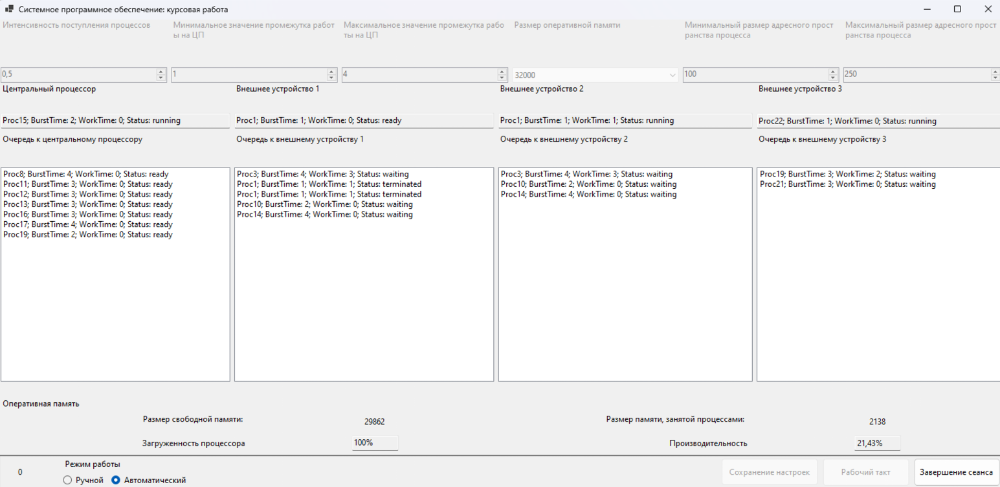

# Course Project: Computing System

## Overview

This course project is developed for the subject "System Software." It simulates a computing system with a single processor operating in a multiprogramming environment. The focus is on process scheduling, memory management, and device I/O operations using an object-oriented approach.

## Project Demo

<details>
<summary><b>Click to expand</b></summary>



System testing demo

</details>

## Features

- Process management with Round-Robin CPU scheduling
- Dynamic memory allocation and deallocation
- Simulation of I/O device interactions
- System monitoring with performance metrics
- Interactive GUI to visualize system state in real time

## Technologies Used

- C#
- Windows Forms (WinForms)
- Object-Oriented Programming (OOP) principles

## How to Run

1. Clone the repository or download the source files.

2. Open the project in **Visual Studio**.

3. Build the solution using:
```
Build > Build Solution (Ctrl+Shift+B)
```

4. Run the application:
```
Debug > Start Debugging (F5)
```
